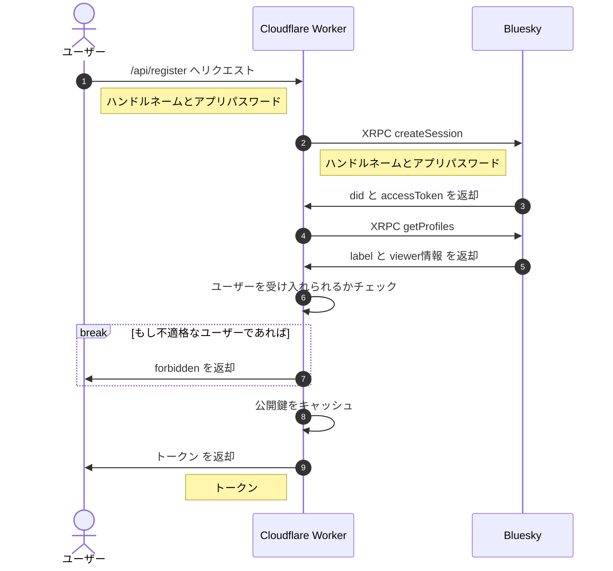
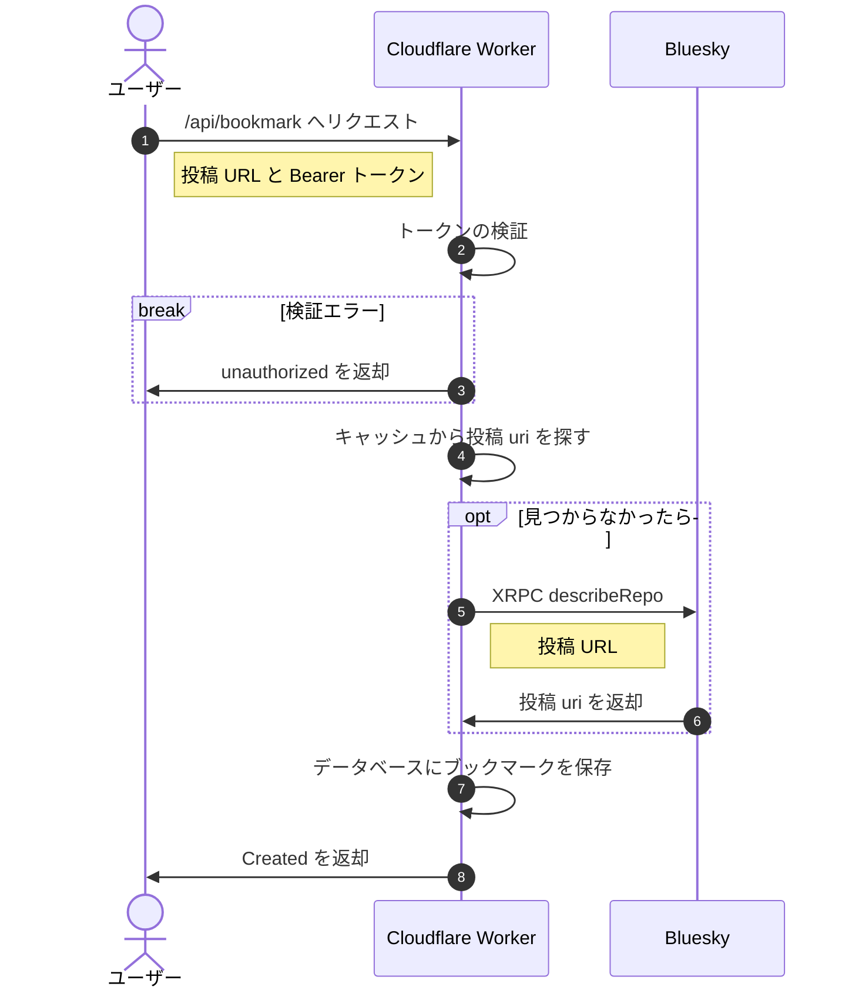
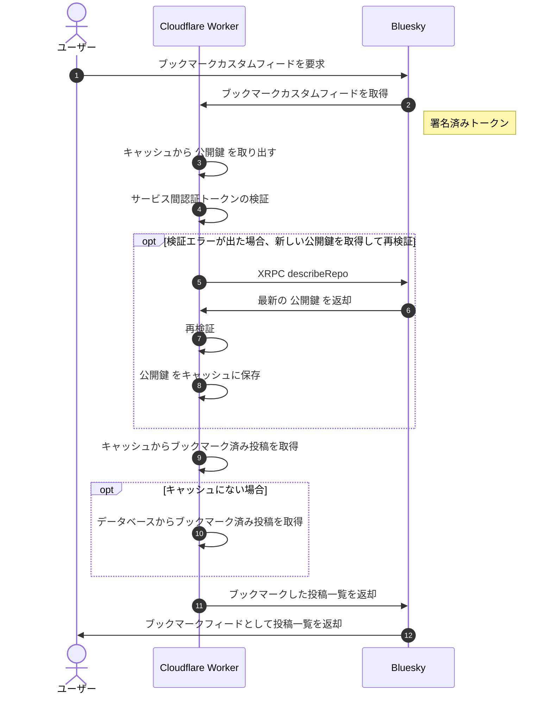

# BlueBookmark

[](https://github.com/mzyy94/bluebookmark/actions/workflows/deploy-workers.yml)


Blueskyでブックマークを実現するためのフィードです。Cloudflare Workers®︎で動作するサーバーレスアプリケーションで、[hono](https://github.com/honojs/hono) を使った簡潔なコードで実現しています。

## 特徴
- 他のユーザーに見られないプライベートなブックマーク
- クラウドエッジで動作する高速な応答性
- 機密情報を保持しない安全な設計
- Web Share Target APIを活用したPWA

## 使い方

### iOSユーザー

1. トップページでトークンを取得
2. iOSショートカットをインストール
  - 例: https://www.icloud.com/shortcuts/bf64334da98343f79d03bf012e48bf51
3. 共有メニューからBlueskyのポストをブックマーク
4. ブックマークフィードを更新

### Androidユーザー

1. トップページでトークンを取得
2. WebページをPWAとしてホーム画面に追加
3. 共有メニューからBlueskyのポストをブックマーク
4. ブックマークフィードを更新

## 制限
- botやspamなど一部のユーザーは利用できません
- 一人当たりのブックマーク数の上限があり、上限に達すると追加ができなくなります

## API

### *POST* `/api/register`

|  field  |   name   |  type  |
|:-------:|:--------:|:------:|
|  form   |  handle  | string |
|  form   | password | string |

ハンドルネームとアプリパスワードを入れてブックマークを編集するトークンを取得します。

> [!CAUTION]
> トークンの管理は厳重に行ってください。万が一流出すると、他人にブックマークが追加されたり削除されたりします（このトークンでブックマークの閲覧はできません）。

### *POST* `/api/bookmark`

|  field  |      name     |     type     |
|:-------:|:-------------:|:------------:|
| header  | Authorization | Bearer token |
|  form   |      url      |     URL      |

ブックマークを追加します。成功すると201ステータスコードでJSONのレスポンスが返ってきます。

### *DELETE* `/api/bookmark`

|  field  |      name     |     type     |
|:-------:|:-------------:|:------------:|
| header  | Authorization | Bearer token |
|  form   |      url      |     URL      |

ブックマークを削除します。成功すると200ステータスコードでJSONのレスポンスが返ってきます。

## 開発

### 必要なもの
- Blueskyアカウント
- Cloudflareアカウント
- GitHubアカウント
- [wrangler](https://developers.cloudflare.com/workers/wrangler/install-and-update/)
- [pnpm](https://pnpm.io)

### プロジェクトの作成

この Deploy ボタンをクリックしてCloudflare Workersプロジェクトを作成します。

[](https://deploy.workers.cloudflare.com/?url=https://github.com/mzyy94/bluebookmark&authed=true&fields={%22name%22:%22Your%20Bluesky%20Handle%20Name%22,%22secret%22:%22FEED_OWNER%22,%22descr%22:%22Handle%20name%20without%20\%22@\%22%22}&fields={%22name%22:%22Your%20Bluesky%20App%20Password%22,%22secret%22:%22APP_PASSWORD%22,%22descr%22:%22App%20Password%20using%20for%20publish%20Bookmark%20Feed%20to%20Bluesky%20serever%22}&fields={%22name%22:%22Feed%20hosted%20Domain%22,%22secret%22:%22FEED_HOST%22,%22descr%22:%22Domain%20on%20which%20your%20feed%20will%20be%20running%22}&fields={%22name%22:%22JWT%20secret%22,%22secret%22:%22JWT_SECRET%22,%22descr%22:%22Random%20strings%20to%20protect%20sessions%20(for%20example:%20af3cdpifvdaih8hqg9)%22}&apiTokenTmpl=[{%22key%22:%22d1%22,%22type%22:%22edit%22},{%22key%22:%22page%22,%22type%22:%22edit%22},{%22key%22:%22access%22,%22type%22:%22edit%22},{%22key%22:%22workers_kv_storage%22,%22type%22:%22edit%22},{%22key%22:%22access_acct%22,%22type%22:%22read%22},{%22key%22:%22dns%22,%22type%22:%22edit%22},{%22key%22:%22workers_scripts%22,%22type%22:%22edit%22},{%22key%22:%22account_rulesets%22,%22type%22:%22edit%22}]&apiTokenName=BlueBookmark)

### 初期設定

1. [`wrangler login`](https://developers.cloudflare.com/workers/wrangler/commands/#login)をPCで実行します。
2. フォークしたリポジトリをcloneしてきます。
3. D1データベースを次のコマンドで作成します `wrangler d1 create bluebookmark`
すると以下のような出力が現れます:

```
⛅️ wrangler 3.28.2
-------------------------------------------------------
✅ Successfully created DB 'bluebookmark' in region APAC
Created your database using D1's new storage backend. The new storage backend is not yet recommended for production workloads, but backs up your data via point-in-time
restore.

[[d1_databases]]
binding = "DB" # i.e. available in your Worker on env.DB
database_name = "bluebookmark"
database_id = "355b4c9e-a40f-4d4a-9a2d-f474b1d3d727"
```

4. `database_id` と書かれた行をコピーして [wrangler.toml](./wrangler.toml) にある database_id の値と置き換えます。
5. KVネームスペースを次のコマンドで作成します `wrangler kv:namespace create did_key_store`
すると以下のような出力が現れます:

```
 ⛅️ wrangler 3.28.2
-------------------------------------------------------
🌀 Creating namespace with title "bluebookmark-did_key_store"
✨ Success!
Add the following to your configuration file in your kv_namespaces array:
{ binding = "did_key_store", id = "0267def52a42498ebfb9f5de18ad4f84" }
```

6. `id` の値をコピーして [wrangler.toml](./wrangler.toml) にある id の値と置き換えます。
7. 次のコマンドでD1データベースを初期化します `wrangler d1 execute bluebookmark --file=drizzle/0000_productive_riptide.sql`
8. wranger.toml ファイルの変更を `git commit` でコミットします。

### デプロイ

変更をGitHubにプッシュするとGitHub Actionsによって自動でデプロイされます。ローカルで `pnpm run deploy` を実行することでもできます。

### Environment Secrets

次の変数をGitHub Actionsのsecrets and variablesに設定する必要があります。

変数名         | 説明
--------------|--
CF_ACCOUNT_ID | Cloudflare の account ID
CF_API_TOKEN  | Cloudflare の API token
FEED_HOST     | feedを実行するドメイン名
FEED_OWNER    | Blueskyのハンドル名 ("@"マーク以降)
JWT_SECRET    | セッションを保護するためのランダム文字列
APP_PASSWORD  | [カスタムフィードの公開](#カスタムフィードの公開)のためのBlueskyのアプリパスワード

### カスタムフィードの公開

カスタムフィードをデプロイできたらBlueskyに公開します。
GitHub Actionsのワークフローから "Publish Feed" を選択し "Run workflow" ボタンをクリックします。
または、 FEED_HOST と FEED_OWNER と APP_PASSWORD 環境変数をセットして `node ./scripts/publish-feed.js` を実行します。

### ローカル開発

次のような内容の .dev.vars という名前のファイルをプロジェクトの最上位ディレクトリに作ります。

```ini
JWT_SECRET=jwt-secret
FEED_OWNER=mzyy94.com
FEED_HOST=bluebookmark-feed.example.com
```

初回のみ `pnpm run init:local` を実行してください。
`pnpm run dev` でローカルサーバーが立ち上がります。


### Cloudflare Pages (Optional)

静的HTMLファイルをCloudflare Pagesから配信したい場合、`wrangler pages project create <任意のプロジェクト名>` を一度実行し `wrangler pages deploy public`で変更をデプロイしてください。
CIでCloudflare Pagesにデプロイするには、プロジェクト名を `PAGES_PROJECT` environment secretにセットしてください。

## プライバシー
- アプリパスワードはユーザーの利用可能権限の確認のためのみに用いられ保存されることはありません
- データベースは暗号化されていないため管理者はデータを平文で見える状態になっています
- デプロイ可能な実装を公開しているため、プライバシーに懸念のある人は誰でも個人でサービスをセットアップできます

## サービス間認証

このブックマークフィードではブックマークを非公開とするためにフィードにアクセスしに来るユーザーを厳格に検証しています。
Blueskyのサーバーで署名されたトークンが付与されたリクエストが正しく検証された場合にのみブックマークが表示される仕組みです。
今の実装では検証のための認証フォーマットは `secp256k1`のみサポートしています。
2024年2月現在は、 [bsky.social](https://bsky.social/) は `secp256k1` を認証キー(Multikey)として利用しているため問題は起きないはずですが、これ以外の認証キーを持つユーザーはブックマークフィードが空の表示になることがあります。

サービス間認証について詳しくは、 AT Protocolの [XRPC](https://atproto.com/specs/xrpc) と [Cryptography](https://atproto.com/specs/cryptography) ページを参照してください。

## ダイアグラム

### 登録



### ブックマーク

#### 追加



#### Delete


### カスタムフィード



## License

このプロジェクトは[MIT](LICENSE)ライセンスで提供されています。
