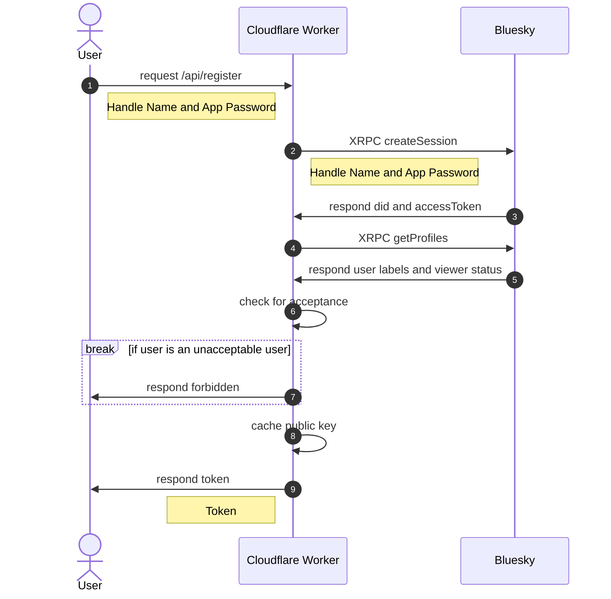
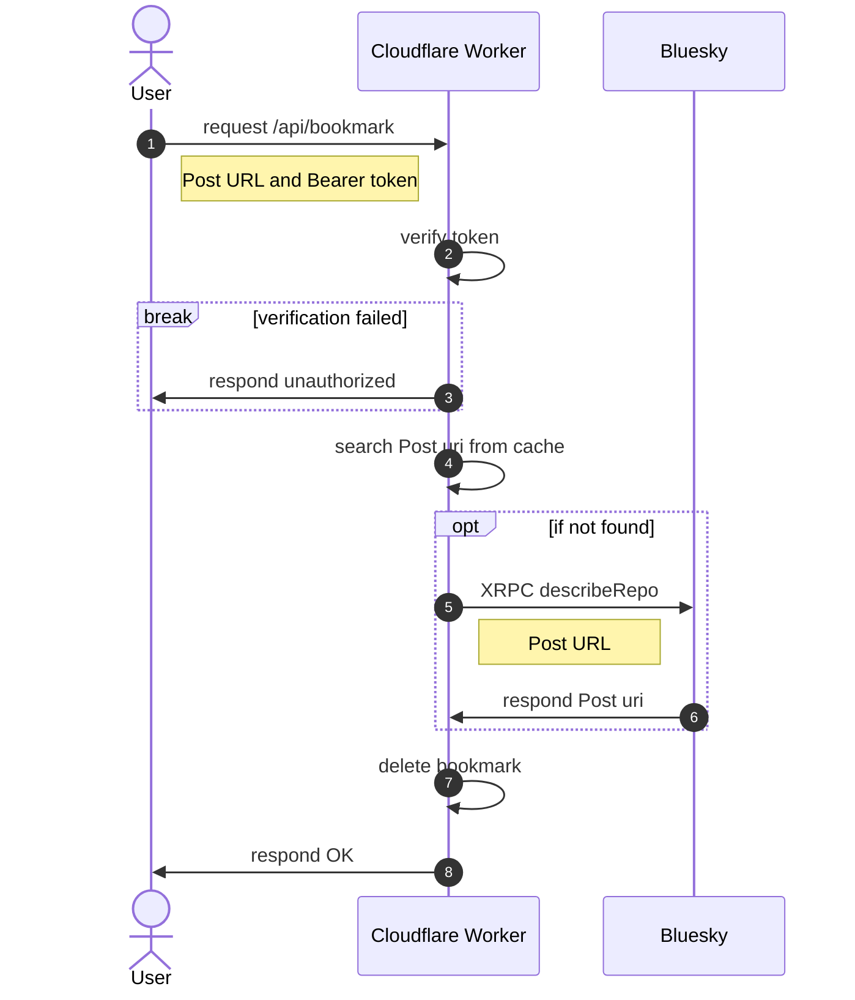
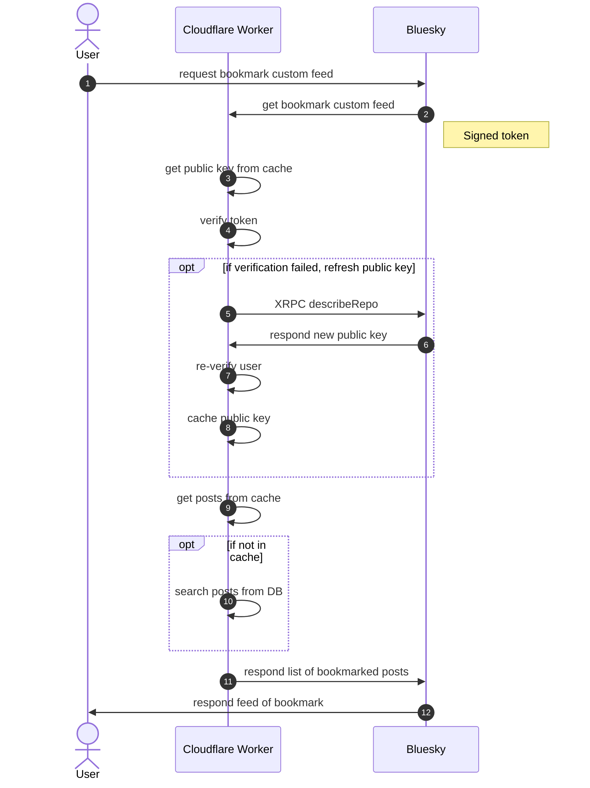

# BlueBookmark

[](https://github.com/mzyy94/bluebookmark/actions/workflows/deploy.yml)

[🇯🇵**日本語版READMEはこちら**🗾](README.ja.md)


Bookmark feed for Bluesky, a serverless application running on Cloudflare Workers®︎, using [hono](https://github.com/honojs/hono) and written in simple code.

## Features
- Private bookmarks hidden from other users
- Fast response time, performed at the cloud edge
- Secure design with no credentials stored
- Progressive Web Application with Web Share Target API

## Usage

### For iOS device

1. Get a token from the top page
2. Install iOS shortcut
  - e.g. https://www.icloud.com/shortcuts/bf64334da98343f79d03bf012e48bf51
3. Bookmark Bluesky post from share menu
4. Refresh bookmark feed

### For Android device

1. Get a token from the top page
2. Install PWA
3. Bookmark Bluesky post from share menu
4. Refresh bookmark feed

## Limitation
- Restricted to only be available for human account.
- A limit on how many bookmarks can be added per person, and once the limit is reached, no more bookmarks can be added.

## API

### *POST* `/api/register`

|  field  |   name   |  type  |
|:-------:|:--------:|:------:|
|  form   |  handle  | string |
|  form   | password | string |

Enter the Handle Name and App Password to get a token to edit bookmarks.

> [!CAUTION]
> Please manage your tokens carefully. If it is leaked, bookmarks will be added or deleted freely (viewing is not allowed with this token).

### *POST* `/api/bookmark`

|  field  |      name     |     type     |
|:-------:|:-------------:|:------------:|
| header  | Authorization | Bearer token |
|  form   |      url      |     URL      |


Add a bookmark. On success, a JSON response is returned with a status code of 201.

### *DELETE* `/api/bookmark`

|  field  |      name     |     type     |
|:-------:|:-------------:|:------------:|
| header  | Authorization | Bearer token |
|  form   |      url      |     URL      |

Delete a bookmark. On success, a JSON response is returned with a status code of 200.

## Development

### Requirements
- Bluesky account
- Cloudflare account
- GitHub account
- [wrangler](https://developers.cloudflare.com/workers/wrangler/install-and-update/)
- [pnpm](https://pnpm.io)

### Create Project

Click Deploy button to create Cloudflare Workers project.

[](https://deploy.workers.cloudflare.com/?url=https://github.com/mzyy94/bluebookmark&authed=true&fields={%22name%22:%22Your%20Bluesky%20Handle%20Name%22,%22secret%22:%22FEED_OWNER%22,%22descr%22:%22Handle%20name%20without%20\%22@\%22%22}&fields={%22name%22:%22Your%20Bluesky%20App%20Password%22,%22secret%22:%22APP_PASSWORD%22,%22descr%22:%22App%20Password%20using%20for%20publish%20Bookmark%20Feed%20to%20Bluesky%20serever%22}&fields={%22name%22:%22Feed%20hosted%20Domain%22,%22secret%22:%22FEED_HOST%22,%22descr%22:%22Domain%20on%20which%20your%20feed%20will%20be%20running%22}&fields={%22name%22:%22JWT%20secret%22,%22secret%22:%22JWT_SECRET%22,%22descr%22:%22Random%20strings%20to%20protect%20sessions%20(for%20example:%20af3cdpifvdaih8hqg9)%22}&apiTokenTmpl=[{%22key%22:%22d1%22,%22type%22:%22edit%22},{%22key%22:%22page%22,%22type%22:%22edit%22},{%22key%22:%22access%22,%22type%22:%22edit%22},{%22key%22:%22workers_kv_storage%22,%22type%22:%22edit%22},{%22key%22:%22access_acct%22,%22type%22:%22read%22},{%22key%22:%22dns%22,%22type%22:%22edit%22},{%22key%22:%22workers_scripts%22,%22type%22:%22edit%22},{%22key%22:%22account_rulesets%22,%22type%22:%22edit%22}]&apiTokenName=BlueBookmark)

### Initialization

1. [`wrangler login`](https://developers.cloudflare.com/workers/wrangler/commands/#login) on your PC.
2. Clone your forked repository.
3. Create D1 database with `wrangler d1 create bluebookmark`
And you can see output like below:

```
⛅️ wrangler 3.28.2
-------------------------------------------------------
✅ Successfully created DB 'bluebookmark' in region APAC
Created your database using D1's new storage backend. The new storage backend is not yet recommended for production workloads, but backs up your data via point-in-time
restore.

[[d1_databases]]
binding = "DB" # i.e. available in your Worker on env.DB
database_name = "bluebookmark"
database_id = "355b4c9e-a40f-4d4a-9a2d-f474b1d3d727"
```

4. Copy a line `database_id` in output and replace database_id in [wrangler.toml](./wrangler.toml)
5. Create KV namespace with `wrangler kv:namespace create did_key_store`
And you can see output like below:

```
 ⛅️ wrangler 3.28.2
-------------------------------------------------------
🌀 Creating namespace with title "bluebookmark-did_key_store"
✨ Success!
Add the following to your configuration file in your kv_namespaces array:
{ binding = "did_key_store", id = "0267def52a42498ebfb9f5de18ad4f84" }
```

6. Copy a value of `id` in output and replace id in [wrangler.toml](./wrangler.toml)
7. Initialize D1 database table with `wrangler d1 execute bluebookmark --file=drizzle/0000_productive_riptide.sql`
8. Commit changes of wranger.toml file with `git commit`

### Deployment

Push your changes to GitHub and it will be automatically deployed by GitHub Actions. You can also run `pnpm run deploy` locally.

### Environment Secrets

The following variables are required for deployment via GitHub Actions.

Variable Name | Description
--------------|--
CF_ACCOUNT_ID | Cloudflare account ID
CF_API_TOKEN  | Cloudflare API token
FEED_HOST     | Domain on which your feed will be running
FEED_OWNER    | Bluesky handle name without "@"
JWT_SECRET    | Random strings to protect sessions
APP_PASSWORD  | Bluesky app password for [Publish Feed](#publish-feed) use

### Publish Feed

After you have deployed the custom feed, publish the feed to Bluesky.
Select the "Publish Feed" workflow from GitHub Actions and click "Run workflow".
Or, run `node ./scripts/publish-feed.js` with FEED_HOST, FEED_OWNER and APP_PASSWORD enviroment variables.

### Local development

Create .dev.vars file in root directory of this project.

```ini
JWT_SECRET=jwt-secret
FEED_OWNER=mzyy94.com
FEED_HOST=bluebookmark-feed.example.com
```

Run `pnpm run init:local` only for the first time.
Start up local server with `pnpm run dev`.

### Cloudflare Pages (Optional)

If you want to serve static HTMLs from Cloudflare Pages, run `wrangler pages project create <YOUR-UNIQUE-PROJECT-NAME>` once and `wrangler pages deploy public` for each change.
To deploy to Cloudflare Pages on CI, set the project name to `PAGES_PROJECT` environment secret.

## Privacy
- The App Password is only used for user identification and availability checks and is not stored, so it is secure.
- Bookmarks are visible to administrators because the data stored in the database is not encrypted.
- Designed as open source and deployable implementation, so anyone can setup their own service if they are concerned about privacy.

## Inter-Service Authentication

This bookmark feed strictly verifies access to the feed to prevent other users from seeing the bookmarks you have privately saved.
The feed content is returned only when a request with a signed token from Bluesky server is successfully verified.
At the moment, the only authentication format supported for verification is `secp256k1`.
As of February 2024, [bsky.social](https://bsky.social/) uses `secp256k1` as Multikey, so it should not be a problem, but it is expected that authentication may fail and the feed may not be displayed.

For more information about authentication, please refer to AT Protocol's [XRPC](https://atproto.com/specs/xrpc) and [Cryptography](https://atproto.com/specs/cryptography) page.

## Sequence Diagram

### Registration



### Bookmark

#### Add


#### Delete



### Custom Feed



## License

Licensed under [MIT](LICENSE)
